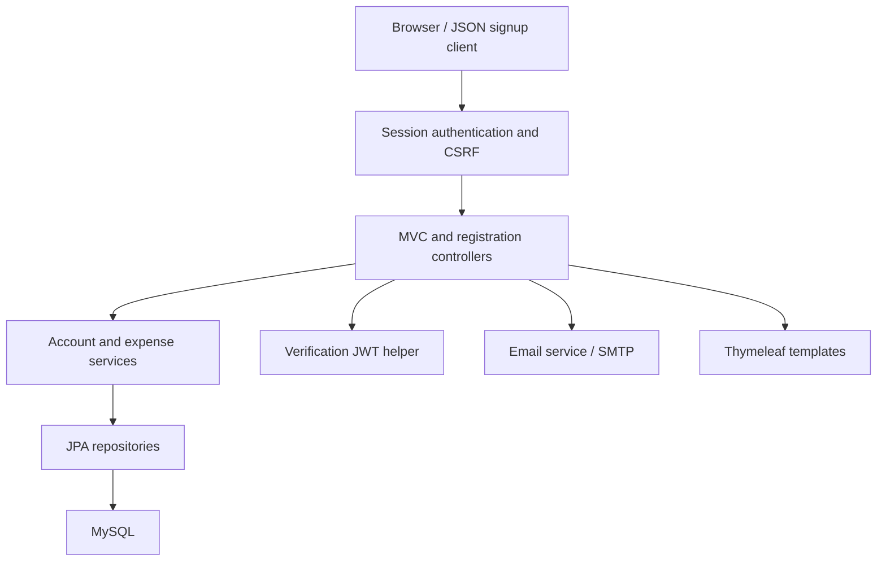
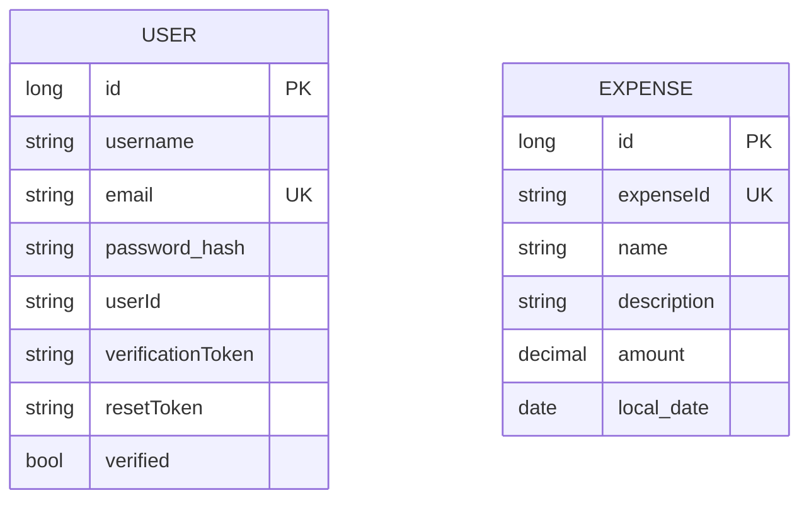

# Architecture — SpringJWT Expense Tracker

## Scope

A Spring MVC monolith renders Thymeleaf pages, stores accounts and expenses using JPA/MySQL, authenticates browser sessions with Spring Security, and signs email-verification links with JJWT. There is no bearer authentication filter or standalone JWT login API.

## Runtime structure

## Responsibilities

| Component | Responsibility |
| --- | --- |
| `AuthController` | Login/registration pages and validated browser signup |
| `ExpenseController` | List, create/edit form, save and POST deletion |
| `ExpenseFilterController` | Keyword/date filters and filtered view |
| `RegistrationController` | JSON signup, password encoding, verification-email requests |
| `VerificationController` | Signed link validation, token comparison, verification state |
| `UserService` | Browser account persistence and username-based authentication |
| `ExpenseService` | Persistence, UUID generation, date mapping, filtering/sorting, totals |
| `ExpenseConverter` | Preserve database and external IDs through DTO mapping |
| `EmailService` | Build SMTP verification/reset messages; reset handler is not implemented |
| `JwtTokenUtil` | One-day signed email claims using a JVM-local random key |
| `SecurityConfig` | Public signup/login/static routes, protected expenses, session login, CSRF |

## Data model

There is no relationship between expenses and users. Every authenticated user sees and can mutate the same expense collection. External UUIDs support stable edit/delete references, while numeric IDs identify persistent rows.

Passwords live in the entity property `password` but contain BCrypt hashes when created by the delivered registration paths. JSON signup discards caller-supplied numeric identity, verified state and reset token. Browser registration similarly sets server-owned account fields. Email is unique; username is not constrained as unique.

## Session flow

1. Browser registration validates `UserDTO` fields and hashes the supplied password.
2. Form login submits to `/login` with a CSRF token.
3. The configured provider loads by username and verifies BCrypt credentials.
4. Successful login redirects to `/req/expenses` and uses a session cookie.
5. Expense POST operations and logout require CSRF tokens.

Public routes are limited to login/signup/registration/verification and static assets; `/req/**` is not broadly public. JSON signup is exempt from CSRF because it is an unauthenticated account-creation API. No cross-user expense ownership restriction is currently possible in the model.

## Verification flow

JSON signup checks email existence. For a new account it hashes the password and stores a signed verification token; an existing unverified account gets another link. SMTP delivery is requested through `EmailService`. Valid links must have a valid signature/expiry and exactly match the token stored for that account.

The first successful verification clears the token and marks the account verified. Subsequent use returns `403`. Invalid or malformed JWTs return `403` rather than escaping as server errors. Tokens expire after one day and use an ephemeral key shared only within the JVM. Restart and multi-instance durability are not solved.

No authorization gate currently checks the verified flag during login. Mail delivery errors are caught and do not roll back registration. Links are built from the request context; production deployments should use an explicit trusted public base URL.

## Expense flow

Services map DTOs to entities and parse `dd/MM/yyyy` dates. Creation generates an external UUID; updates preserve it. List/read project to DTOs and format dates for the view. Filtering queries by name and date interval, then sorts by descending date or amount. Totals sum decimal amounts and format a numeric two-decimal result.

Thymeleaf owns the displayed currency symbol and escapes ordinary text fields. Delete is a CSRF-protected POST. The legacy validator supports a null-safe missing-date check but is not globally bound to all expense form operations; comprehensive write validation remains work to do.

## Persistence and profiles

Default database configuration uses environment-driven MySQL with `ddl-auto=validate`. The local profile uses `update` for development bootstrap. Tests use H2 in MySQL compatibility mode with `create-drop`. Hibernate bootstrap is not a schema migration strategy.

The source's automatic Spring Data REST repository exposure was removed. Repository interfaces are persistence components, not public entity CRUD APIs. Swagger annotations and resource configuration remain, but no working generated Swagger UI/API documentation feature is claimed.

## Verification limits

Tests exercise full Spring startup, rendered forms, real authentication, BCrypt hashes, shared expense persistence/edit/filter/delete, CSRF rejection and verification-token consumption. SMTP calls are mocked. Unit tests exercise converter identities, decimal totals, dates, filter defaults/sorting and JWT signature failures.

No live MySQL or SMTP, browser automation, concurrent registration, load, deployment or multi-instance token test is claimed. [TESTING.md](TESTING.md) contains measured results.
